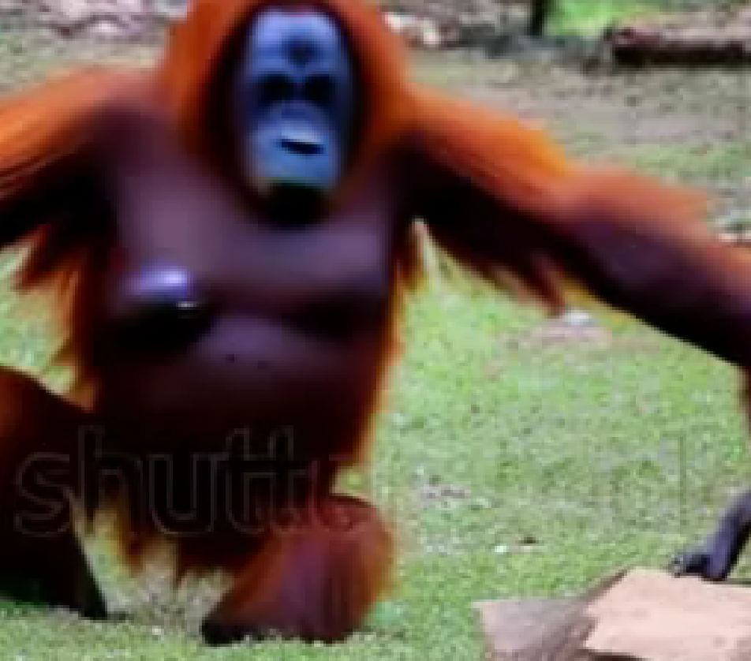
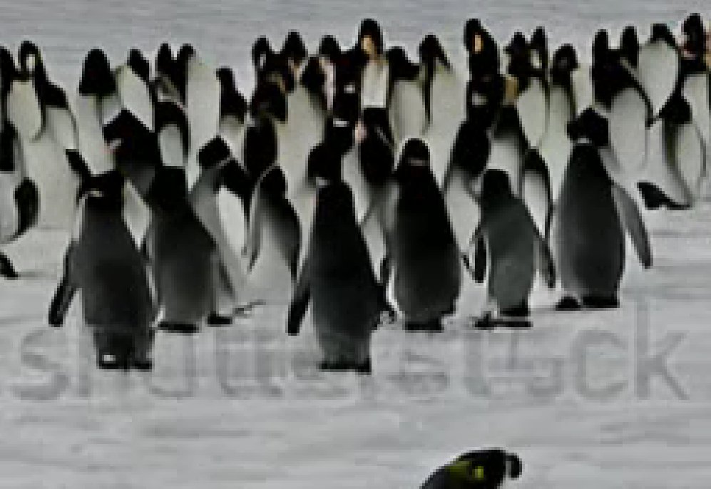

# Text-to-video using damo-vilab/text-to-video-ms-1.7b

This repository demonstrates the usage of the "damo-vilab/text-to-video-ms-1.7b" model, a multi-stage text-to-video generation diffusion model developed by [ModelScope](https://github.com/modelscope/modelscope).

## Usage

1. **Install Dependencies**

   Make sure to install the required dependencies by running:

   ```bash
   pip install diffusers transformers accelerate
   ```

2. **Open in Google Colab**

   Open the "text2video.ipynb" notebook in [Google Colab](https://colab.research.google.com/) by clicking on the following link: [Open in Colab](link-to-colab-notebook).

   Ensure that you have a Google account and are signed in to use Colab's interactive notebook environment.

3. **Run the Notebook**

   Run the notebook to generate videos based on text prompts. The generated videos will be saved in .mp4 format.

## Results Showcase

### Small Video
#### Prompt: "Orangutan is playing"

<a href="videos/small_video.mp4">
  
</a>

### Large Video
#### Prompt: "Penguins plan a surprise party for a polar bear"

<a href="videos/large_video.mp4">
  
</a>

Click on the video thumbnails to view the results.

## Attribution and Citation

This work is based on the "damo-vilab/text-to-video-ms-1.7b" model developed by [ModelScope](https://github.com/modelscope/modelscope). Please refer to their [GitHub Repository](https://github.com/modelscope/modelscope) and cite the provided references in your work.

## License

This repository contains code derived from the "damo-vilab/text-to-video-ms-1.7b" model developed by ModelScope, which is licensed under [CC-BY-NC-ND](https://creativecommons.org/licenses/by-nc-nd/4.0/).

For details regarding the license terms, please refer to the [CC-BY-NC-ND 4.0 license](https://creativecommons.org/licenses/by-nc-nd/4.0/).
